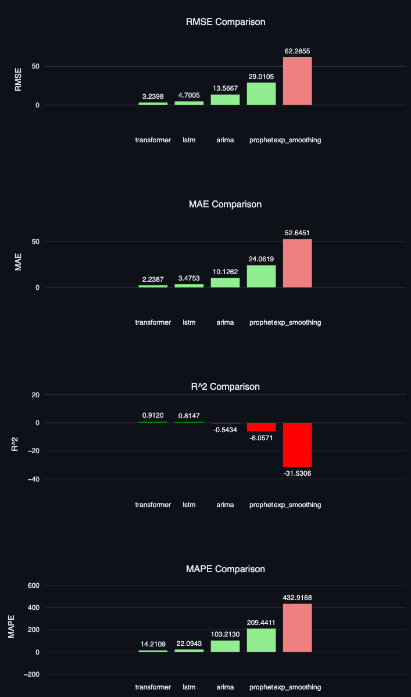

\begin{titlepage}
\begin{center}
\vspace*{2cm}

\Huge\textbf{생성형 인공지능 기반 시계열 예측 자동화 연구 - 서울시 대기질 데이터를 중심으로}\\

\vspace{1.5cm}

\LARGE 석사학위 논문\\

\vspace{2cm}

\large 이름: 이루오\\
\large 학번: 2426527021\\
\large 전임교수: 오태연 교수\\
\large 전공: AI 빅데이터 석사과정\\
\large 학교: aSSIST(서울과학종합대학원)\\
\vspace{3cm}

\large\today\\

\vspace{2cm}

\large aSSIST(서울과학종합대학원)\\
\end{center}
\end{titlepage}

\chapter*{초록}
\addcontentsline{toc}{chapter}{초록}

본 연구는 생성형 인공지능(LLM)을 활용하여 시계열 예측의 전 과정을 자동화하는 프레임워크를 제안한다. 서울시 대기질(PM2.5) 데이터를 대상으로 지수평활법, ARIMA, Prophet, LSTM, Transformer 등 다양한 시계열 예측 모델을 적용하고, Gemma3:27B를 이용하여 각 모델의 하이퍼파라미터를 자동으로 튜닝하였다. 실험 결과, 기본 모델 중에서는 Transformer가 RMSE 3.24, R² 0.91, MAPE 14.21%로 가장 우수했으나, LLM 기반 튜닝을 거친 LSTM 모델이 RMSE 2.76, R² 0.94, MAPE 12.49%로 최고의 예측 성능을 달성하였다. 이는 기본 LSTM 모델 대비 RMSE 41.23%, MAPE 43.47% 등 평균 40% 이상의 성능 향상을 의미한다. 또한 LLM을 활용하여 최적 모델의 선정 근거와 예측 결과에 대한 분석 보고서를 자동 생성함으로써, 데이터 사이언티스트의 개입을 최소화한 엔드투엔드 자동화가 가능함을 입증하였다. 이러한 접근 방식은 전통적인 AutoML을 넘어 LLM의 도메인 지식과 추론 능력을 활용한 새로운 시계열 분석 패러다임을 제시한다.

\newpage
\tableofcontents
\newpage

\listoffigures
\newpage

\listoftables
\newpage

\chapter{서론}

산업의 발전과 함께 대기질 예측에 대한 관심이 높아지고 있다. 특히 초미세먼지(PM2.5)는 인체 건강과 직결된 중요한 대기 오염 물질로, 정확한 시계열 예측을 통해 사전 대응책을 마련하는 것이 필수적이다. 그러나 시계열 데이터를 예측하기 위해서는 ARIMA[1]와 지수평활법[2] 같은 전통 통계 모델부터 LSTM[4]과 **변환기(Transformer)[5]** 와 같은 딥러닝 모델에 이르기까지 다양한 접근 방법이 존재하며, 각 모델마다 수많은 하이퍼파라미터를 적절히 설정해야 최적의 성능을 얻을 수 있다. 이러한 모델 선택과 튜닝 과정은 전문 지식과 많은 실험을 요구하며, 자동화하기 어려운 부분으로 남아 있었다.

최근 들어 거대 언어 모델과 같은 **생성형 인공지능(Generative AI)** 의 발전으로, 자연어 처리에 국한되지 않고 데이터 분석 및 모델 설계에 AI를 활용하려는 시도가 증가하고 있다. 대규모 언어 모델(LLM)[6]은 방대한 지식과 추론 능력을 바탕으로 복잡한 문제에 대한 통찰이나 제안을 제공할 수 있다. 실제로 GPT-4[6]와 같은 최신 LLM은 여러 전문 분야 문제에서 사람 수준의 성능을 보이고 있어, 이러한 모델을 시계열 예측의 하이퍼파라미터 튜닝이나 결과 분석 보고 자동 생성에 활용할 가능성이 주목받고 있다.

본 연구의 목표는 생성형 AI[6,7]를 활용하여 시계열 예측의 모델링부터 보고서 작성까지 자동화하는 것이다. 이를 위해 서울시 대기질(PM2.5) 데이터를 사례로 다양한 시계열 예측 모델(ARIMA[1], 지수평활법[2], Prophet[3], LSTM[4], Transformer[5])을 적용하고, OpenAI GPT 계열과 유사한 대규모 언어 모델인 Gemma3:27B[6,7]를 이용하여 각 모델의 하이퍼파라미터를 자동으로 튜닝하였다. 또한, 최적의 모델을 선정하고 예측 결과를 분석하는 **리포트(보고서)** 를 LLM이 Markdown 형식으로 생성하도록 함으로써, 데이터 사이언티스트의 개입을 최소화한 완전 자동화 시계열 예측 시스템을 구축하였다.

본 논문에서는 이러한 연구의 전 과정을 석사논문 형식에 맞추어 상세히 기술한다. 2장 이론적 배경에서는 시계열 예측에 사용된 주요 모델들의 원리와 하이퍼파라미터 튜닝의 중요성, 그리고 생성형 AI의 시계열 적용 가능성에 대해 살펴본다. 3장 연구 방법에서는 제안하는 자동화 시스템의 구조와 구현 방법을 설명하며, 데이터 세트와 모델 구성, LLM을 활용한 튜닝 절차를 기술한다. 4장 실험 및 결과에서는 서울시 대기질 데이터를 대상으로 각 모델의 예측 성능을 비교하고 분석하며, LLM 기반 자동 튜닝의 효과를 검증한다. 마지막으로 5장 결론 및 향후 연구에서는 본 연구의 성과를 요약하고, 생성형 AI를 활용한 자동화의 확장 가능성과 향후 보완점을 논의한다.

\chapter{이론적 배경}

2.1 시계열 예측 모델 개요

시계열 예측을 위해 본 연구에서 다룬 대표적인 모델들은 통계적 방법과 딥러닝 방법으로 나눌 수 있다. **지수평활법(Exponential Smoothing)**은 과거 데이터에 지수적으로 감쇠하는 가중치를 부여하여 미래를 예측하는 기법으로, **Brown(1956)**과 Holt(1957)[2] 등에 의해 체계화되었고 이후 **Winters(1960)**[2]에 의해 계절성까지 포함한 삼중 지수평활법으로 확장되었다 . 지수평활법은 구현이 간단하고 계산이 빠르며 비교적 짧은 기간의 추세와 계절 패턴을 포착하는 데 사용된다. 그러나 뚜렷한 추세나 복잡한 계절 변동이 있는 경우에는 정확도가 떨어질 수 있고, 예측 결과가 장기적인 패턴을 충분히 반영하지 못하는 한계가 있다.

ARIMA(Autoregressive Integrated Moving Average) 모델은 자기회귀(ar)와 이동평균(ma), 차분(d)의 세 요소를 조합하여 시계열 데이터를 모형화하는 전통적인 방법이다. ARIMA 모델은 Box와 Jenkins[1]에 의해 1970년 소개된 이래 시계열 분석의 대표적인 기법으로 널리 활용되었다 . Box-Jenkins 방법론은 시계열의 자기상관성을 활용하여 적절한 모형 차수(p, d, q)를 식별하고 모수 추정과 진단을 거쳐 예측을 수행한다. ARIMA는 데이터의 정상성(stationarity) 가정 하에 동작하며, 계절 변동이 있는 경우 계절형 ARIMA(SARIMA)로 확장하여 계절 차분 및 계절 모수를 포함할 수 있다. ARIMA의 장점은 자기상관 구조를 명시적으로 모델링하여 단기 예측에 강점이 있다는 점이며, 단점은 비정상 시계열의 차분 작업, 계절성에 대한 별도 모형화 등이 필요하여 과정이 복잡하고, 모형 식별을 위한 전문 지식이 요구된다는 점이다.

Prophet은 2017년 페이스북(Facebook)에서 공개한 오픈소스 예측 라이브러리로, **Taylor와 Letham(2018)**[3]의 연구에 기반한 가법 모델(additive model) 접근법을 사용한다. Prophet 모델은 시계열을 **장기 추세(trend) + 계절성(seasonality) + 휴일 효과(holidays)**의 합으로 보고 이를 개별적으로 모델링한다. 추세는 선형 또는 로그형 성장으로, 계절성은 주기적인 패턴(예: 연중, 주중, 일중 주기)으로 표현하며, 휴일이나 이벤트의 효과를 추가적인 회귀요소로 포함한다 . Prophet의 가장 큰 장점은 사용 편의성으로, 데이터에 내재된 추세와 계절성을 자동으로 처리하고 이상치에 강건하게 동작하도록 설계되었다. 별도의 정상성 변환이나 복잡한 모수 결정 과정 없이도 기본값으로도 빠르게 양질의 예측을 얻을 수 있다는 점에서 실무 영역에서 인기를 얻고 있다. 다만 Prophet은 복잡한 패턴(예를 들어, 추세 변화가 빈번하거나 불규칙한 패턴)의 예측력에서는 한계가 있을 수 있으며, 충분한 과거 데이터가 없는 경우에는 불확실성이 커지는 단점이 있다.

LSTM(Long Short-Term Memory)은 **순환 신경망(RNN)**의 일종으로, 시계열과 같은 순차 데이터의 장기 의존성(long-term dependency) 문제를 해결하기 위해 고안된 딥러닝 모델이다[4] . RNN은 이전 시점의 출력이나 상태를 다음 시점의 입력으로 사용함으로써 시계열 패턴을 학습하지만, 기울기 소실(vanishing gradient) 문제로 긴 시퀀스의 정보를 전달하기 어려웠다. LSTM은 **셀 상태(cell state)**와 입력게이트, 출력게이트, 망각게이트 등의 구조를 도입하여 불필요한 정보는 잊고(long short-term forget), 필요한 정보는 장기간 기억할 수 있도록 함으로써 RNN의 한계를 극복하였다. 이로 인해 LSTM은 수백 시점에 이르는 긴 시계열도 학습이 가능하며, 시계열 데이터의 복잡한 패턴까지 포착하는 데 뛰어난 성능을 보인다. 다만 LSTM 모델은 많은 수의 파라미터를 가지므로 충분한 훈련 데이터가 필요하고 학습에 시간이 오래 걸릴 수 있다. 또한 모델의 내부 구조가 복잡하여 예측 결과를 해석하기 어렵다는 단점도 있다.

Transformer 모델은 2017년 Vaswani 등에 의해 제안된 어텐션 기반 딥러닝 아키텍처로, seq2seq(sequence-to-sequence) 모델의 새로운 패러다임을 열었다[5] . Transformer의 핵심은 자기어텐션(self-attention) 메커니즘으로, 시퀀스 내 모든 위치의 데이터를 상호 참조하여 관계를 학습한다. 이를 통해 RNN처럼 순차적으로 계산하지 않고 병렬 처리로 학습을 수행할 수 있어, 매우 긴 시퀀스도 효율적으로 학습 가능하고 병렬화로 인한 속도 이점도 얻을 수 있다. Transformer는 원래 자연어 처리의 기계번역 등에서 혁신적인 성능을 보였으며, 이후 다양한 분야로 확산되어 범용 아키텍처로 자리잡았다. 시계열 예측 분야에서도 Transformer 기반 예측 모델들이 등장하여 LSTM 이상의 성능을 보이는 사례들이 보고되고 있다. Transformer의 장점은 멀리 떨어진 시점 간의 상관관계도 학습할 수 있는 강력한 표현력과 학습 효율이며, 단점으로는 많은 층과 헤드(head)를 갖는 복잡한 구조로 인해 모델 학습에 대량의 데이터가 필요하고, 결과를 해석하거나 원인을 추적하기 어려운 점이 있다.

요약하면, 전통 모델(지수평활법, ARIMA, Prophet)은 비교적 구현이 간단하고 명확한 통계적 해석이 가능하나 복잡한 패턴을 충분히 포착하지 못할 수 있다. 반면 딥러닝 모델(LSTM, Transformer)은 비선형적이고 복잡한 패턴 학습에 강력하지만 많은 데이터와 계산자원이 요구되며 모델 해석력 부족 문제가 있다. 이러한 모델들의 특성과 한계를 이해하고 문제에 맞게 선택하거나 결합하는 것이 시계열 예측 성능 향상의 열쇠이다.

2.2 하이퍼파라미터 튜닝과 AutoML

각각의 시계열 예측 모델은 내재적인 **하이퍼파라미터(hyperparameter)**를 가지고 있으며, 이들의 설정에 따라 예측 성능이 크게 좌우된다. 예를 들어 ARIMA의 (p,d,q) 차수나 계절 주기, Prophet의 변화점 민감도나 계절성 유무, LSTM의 은닉층 크기나 학습률 등은 모두 성능에 영향을 미치는 중요한 하이퍼파라미터다. 최적의 하이퍼파라미터를 찾기 위해서는 일반적으로 그리드 탐색(grid search), 임의 탐색(random search), 베이지안 최적화 등의 기법을 활용하지만, 시계열 모델의 경우 검색 공간이 넓고 교차검증이 어려운 경우가 많아 효율적인 튜닝이 쉽지 않다. 특히 딥러닝 모델은 조합 가능한 파라미터가 매우 많아 경험적인 설정이나 반복 실험에 의존하는 경우가 빈번하다.
이러한 배경에서 **AutoML(Automated Machine Learning)**에 대한 관심이 높아졌으며, 시계열 예측 분야에서도 자동화된 모델 선택 및 파라미터 최적화 도구들이 등장하고 있다. 대표적으로 일부 라이브러리(Azure AutoML, AutoKeras 등)나 AutoARIMA, Hyndman 등의 자동 시계열 예측 함수는 사용자 개입을 줄이고 알고리즘적으로 최적화를 시도한다. 그러나 AutoML 방식은 주로 사전 정의된 알고리즘을 기반으로 작동하기 때문에 복잡한 도메인 지식을 활용하거나 새로운 통찰을 제공하는 데 한계가 있다. 또한 결과에 대한 해석이나 추론은 사람이 별도로 수행해야 하므로 완전한 자동화라 부르기 어렵다.

2.3 생성형 AI와 시계열 분석

생성형 인공지능, 특히 **대규모 언어 모델(LLM)[6]**의 부상은 자동화의 새로운 가능성을 열고 있다. ChatGPT나 GPT-4[6] 등으로 대표되는 LLM은 대용량 텍스트 코퍼스를 학습하여 인간과 유사한 언어 생성 능력을 갖추었을 뿐만 아니라, 복잡한 문제에 대한 추론과 판단을 내릴 수 있는 잠재력을 보여주고 있다. 예컨대 GPT-4[6]는 광범위한 벤치마크에서 인간 수준의 성능을 보이며, 사용자 질의에 대한 전문적인 조언이나 창의적인 해결책을 제시할 수 있다. 이러한 능력은 단순한 텍스트 생성 외에도, **데이터 분석 맥락에서 LLM을 조력자(agent)로 활용[7]**할 수 있음을 시사한다.

시계열 분석에서 LLM을 활용하는 아이디어는 새롭고 독창적인 접근이라 할 수 있다[7]. LLM은 방대한 도메인 지식과 패턴 인식 경험을 내재하고 있으므로, 적절한 프롬프트(질의)를 통해 모델의 개선 방향 제안, 하이퍼파라미터 추천, 결과 해석 및 보고서 작성 등의 작업을 도울 수 있다. 즉, LLM을 단순 응답 생성기가 아니라 분석가의 역할로 설정하여, 시계열 모델링 프로세스의 일부를 맡길 수 있는 것이다. 이러한 접근은 기존 AutoML과 달리 고정 알고리즘이 아닌 유연한 지식 기반의 처리가 가능하다는 장점이 있다. LLM은 데이터의 특징이나 이전 실험 결과를 해석해 사람처럼 논리적인 제안을 할 수 있고, 경우에 따라서는 훈련되지 않은 새로운 문제에도 **제로샷(zero-shot)[7]**으로 대응할 수 있는 일반화 능력이 있다.

다만 LLM을 실제 예측 모델의 튜닝에 활용하기 위해서는 몇 가지 고려할 점이 있다. 첫째, LLM이 출력하는 제안의 신뢰성 검증이 필요하다. LLM이 그럴듯하지만 잘못된 조언을 할 가능성도 있으므로, 이를 자동으로 받아들이기보다는 실험적 검증 절차와 결합해야 한다. 둘째, LLM과의 인터랙션을 위한 프롬프트 디자인이 중요하다. 원하는 정보를 LLM이 충분히 이해하고 활용할 수 있도록, 예를 들어 “데이터에 하루 주기의 계절성이 보인다. 적합한 ARIMA 모형 차수를 추천하라”와 같은 구체적이고 맥락 있는 지시를 내리는 것이 핵심이다. 셋째, LLM 자체의 컴퓨팅 자원 요구와 응답 시간도 고려해야 한다. 대규모 모델일수록 뛰어난 응답을 줄 수 있으나, 연구 환경에서 실행하려면 GPU 메모리 등 자원 한계가 있을 수 있다.

그럼에도 불구하고, 생성형 AI를 활용한 시계열 예측 자동화는 데이터 과학자의 경험과 노하우를 부분적으로 대체하거나 보조함으로써, 예측 작업의 효율을 크게 향상시킬 수 있는 잠재력을 갖는다. 본 연구는 이러한 가능성을 현실화하기 위한 한 시도로, LLM을 통해 시계열 모델링 과정을 자동화하고 예측 분석 보고서까지 생성하는 엔드투엔드 파이프라인을 제안한다.

\chapter{연구 방법}

3.1 연구 개요 및 시스템 구조

본 연구에서는 앞서 언급한 아이디어를 구현하기 위해 LLM 기반 시계열 예측 자동화 시스템을 설계하였다. 전체 시스템의 구조는 데이터 입력 → 모델군 예측 → LLM 튜닝 피드백 → 최적 모델 선정 → 보고서 생성의 흐름으로 구성된다. 그림 3.1은 시스템의 개략적인 아키텍처를 보여준다 (※구체적인 그림은 생략).

먼저 사용자로부터 입력된 시계열 데이터를 전처리하여 훈련/테스트 데이터셋으로 구분한다. 이어서 여러 종류의 예측 모델(통계 모델 3종 + 딥러닝 모델 2종)을 초기 하이퍼파라미터로 학습시키고, 각 모델의 예측 결과 및 성능 지표를 산출한다. 이때 얻어진 성능 결과를 토대로 대화형 LLM에게 어떤 하이퍼파라미터 조정이 필요한지 질의한다. LLM은 자신이 내장한 지식과 논리를 활용해 모델별 개선 방안을 제시하며, 시스템은 그 제안에 따라 해당 모델을 재학습하거나 튜닝을 반복한다. 이러한 LLM-in-the-loop 최적화 과정을 거쳐 성능이 개선되면, 최종적으로 최고의 성능을 보이는 모델을 선택하고 향후 전망을 예측한다. 마지막 단계에서 다시 LLM을 활용하여 전체 실험 결과를 요약/분석하는 **리포트 문서(Markdown)**를 자동 생성함으로써, 사용자에게 이해하기 쉬운 형태로 결과를 제공한다. 이 모든 과정은 하나의 스트림릿(Streamlit) 웹 애플리케이션 상에서 통합적으로 이루어지며, 사용자는 GUI를 통해 데이터 업로드부터 보고서 다운로드까지 일련의 과정을 간편하게 수행할 수 있다.

시스템 구현에 있어 주요 구성 요소는 다음과 같다:

    대기질 시계열 데이터셋: 서울시 환경공단 등에서 제공하는 PM2.5 시간별 농도 데이터 (본 연구에서는 2025년 3월 14일 ~ 4월 13일 데이터를 사용).

    시계열 모델군: 통계 모델로 지수평활법(Holt-Winters), ARIMA, Prophet을 사용하고, 딥러닝 모델로 LSTM, 변환기 기반 모델을 구현하였다.

    LLM 모듈: 생성형 AI로 Gemma3:27B 모델을 활용하였다. Gemma3:27B는 약 270억 개의 매개변수를 가진 다국어 대형 언어 모델로, 사전 훈련된 방대한 지식을 바탕으로 사용자 프롬프트에 대한 뛰어난 응답 능력을 갖춘 것으로 알려져 있다. 본 연구에서는 Gemma3:27B를 로컬 GPU 서버에 로드하여 API 형태로 질의-응답에 사용하였다.

    웹 UI: Streamlit 라이브러리를 통해 웹 인터페이스를 구현하였다. 사용자는 웹 페이지에서 파라미터(예: 예측 기간 등)를 설정하고 실행 버튼을 누르면, 백엔드에서 일련의 과정이 수행되고 최종적으로 결과 보고서가 화면에 표시된다.

요약하면, 본 연구의 시스템은 여러 예측 알고리즘과 LLM의 추론 능력을 하나로 결합하여, 데이터 입력부터 모델 최적화, 결과 분석까지 원스톱으로 처리하는 구조이다. 이는 기존에 사람이 직접 하나하나 수행하던 모델 튜닝과 보고서 작성 작업을 자동화하였다는 점에서 의의가 있다.

3.2 데이터 및 전처리

실험에 사용된 데이터는 서울시 대기질 정보 중 하나인 PM2.5(초미세먼지) 시간대별 농도 자료이다. 데이터 기간은 2025년 3월 14일부터 2025년 4월 13일까지 약 한 달치로, 총 742개의 시간 단위 데이터 포인트를 포함한다. 이 데이터는 서울시의 한 측정소에서 시간별로 측정된 PM2.5 농도(단위: ㎍/m³)를 나타내며, 해당 기간 동안 봄철 대기질의 특성을 반영하고 있다. 전체 데이터 중 80%인 593개를 훈련 데이터로 사용하였고, 나머지 20%인 149개를 테스트 데이터로 hold-out하였다. 훈련 데이터로 모델들을 학습시킨 후, 앞으로의 149시간에 해당하는 PM2.5 농도를 예측하게 하여 그 결과를 실제 측정값과 비교함으로써 성능을 평가하였다.

전처리 과정으로는 먼저 데이터의 이상치와 결측치를 확인하였다. 해당 기간 자료에는 측정 오류로 인한 극단값이나 누락이 거의 없었으므로 별도의 이상치 제거나 보간 처리 없이 원본 데이터를 사용하였다. 다만 LSTM과 Transformer 모델의 학습을 위해 **정규화(normalization)**를 수행하였다. 각 모델 입력에 사용되는 시계열 윈도우 데이터는 0~1 범위로 Min-Max 정규화하여 학습이 수월하도록 하였다. (예측한 출력은 나중에 다시 역정규화하여 실제 농도로 환산함.) 또한, 데이터의 계절성 분해를 간단히 확인하기 위해 시간에 따른 패턴을 살펴보았다. 1일(24시간) 주기의 주기적인 변동이 존재하여 일중(日中) 주기성이 나타남을 확인하였고, 주말/평일 등의 패턴은 한 달 내에서는 크게 두드러지지 않는 것으로 관찰되었다. 전반적인 추세는 뚜렷하지 않았으나, PM2.5 농도 값이 시간에 따라 큰 폭으로 오르고 내리는 높은 변동성을 보였다.

데이터의 기본 통계량을 요약하면 다음과 같다:
- 최소값: 2.08 ㎍/m³
- 최대값: 80.36 ㎍/m³
- 평균값: 27.20 ㎍/m³
- 표준편차: 14.56 ㎍/m³

해당 기간 평균 27㎍/m³는 세계보건기구(WHO) 권고기준을 상회하는 수준으로, 서울시 대기 질 관리가 필요한 수준임을 시사한다. 또한 최대-최소의 범위가 2부터 80까지 매우 넓어, 농도 변동성이 상당히 크다는 것을 알 수 있다. 이러한 특성을 고려하여 각 모델이 일별 주기 패턴과 급격한 변화를 얼마나 잘 포착하는지가 예측 성능의 관건이 될 것으로 예상되었다.

3.3 모델 구현 및 구성

본 연구에서는 3.2절의 데이터를 이용하여 앞서 언급한 다섯 가지 시계열 예측 모델을 모두 구현하고 비교하였다. 각 모델의 구체적인 구현 방식과 초기 하이퍼파라미터 설정은 다음과 같다.
지수평활법 모델: statsmodels 라이브러리의 Holt-Winters 구현을 사용하였다[2]. 데이터의 24시간 주기를 반영하기 위해 **계절 기간(seasonal period)**을 24로 설정하고, 계절 패턴과 추세를 모두 고려하는 Additive Triple Exponential Smoothing을 적용하였다. 초기 smoothing 계수(alpha, beta, gamma)는 라이브러리의 자동 최적화 기능을 사용하여 추정하였으며, 예측은 테스트 구간(149시간)에 대해 direct forecasting으로 한 번에 149시간치를 예측하도록 하였다.

ARIMA 모델: 데이터의 ACF/PACF를 참고하여 초기 모형 차수를 선정하고 pmdarima의 auto_arima 함수를 활용하여 구체적인 (p,d,q) 및 (P,D,Q,m)을 탐색하였다[1]. 일중 계절성을 반영하기 위해 **계절 차분(24시간 주기)**을 1회 적용하는 SARIMA 모델을 고려하였다. 초기 값으로 (p,d,q)=(2,0,2), (P,D,Q)=(1,1,1) 등의 조합을 시도하였고, AIC 기준으로 가장 적합한 모델을 선택하였다. 최종적으로는 ARIMA(1,0,1) (비계절) 모델이 선택되었는데, 이는 데이터의 하루 주기 변동이 강하지만 auto_arima가 짧은 기간 내에서는 계절성을 배제한 모형을 선호했기 때문으로 판단된다. (계절 모형의 경우 파라미터가 늘어나 작은 데이터셋에서는 과적합 우려가 있음)

Prophet 모델: fbprophet 라이브러리를 사용하여 구현하였다[3]. Prophet의 기본 설정을 적용하되, 데이터 기간이 1개월로 비교적 짧으므로 연간/월간 계절성은 비활성화하고 일별(日別) 계절성을 수동으로 추가하였다. 또한 변화점(change point) 탐지 민감도를 약간 높이기 위해 changepoint_prior_scale을 기본 0.05에서 0.1로 증가시켜 갑작스런 추세 변화에 대응하고자 했다. 모델 학습에는 기본 Bayesian sampling 방법을 사용하여 1000번의 샘플링(iterations)으로 사후분포를 추정하였으며, 예측은 테스트 구간에 대해 수행하였다.

LSTM 모델: 파이썬의 TensorFlow-Keras를 활용하여 LSTM 신경망을 구성하였다[4]. 입력 시퀀스 길이는 24시간 (과거 24개의 시점의 농도)으로 설정하여 하루 주기의 패턴을 학습할 수 있도록 하였다. 네트워크 구조는 **LSTM 레이어 1개 (은닉 노드 100개)**와 뒤에 완전연결(Dense) 출력 레이어로 구성된 단층 LSTM으로 시작하였고, 과적합을 막기 위해 LSTM 층에 드롭아웃(dropout) 0.2를 적용하였다. 손실 함수는 회귀 문제이므로 MSE를 사용하고, Adam 옵티마이저로 학습률 0.001로 80 epochs 학습하였다. 초기에는 이 기본 구조로 학습하고, 이후 LLM의 조언에 따라 레이어 수나 노드 수 등을 변경하기도 했다. 예를 들어 1차 실험 후 LLM이 **“패턴이 복잡하므로 LSTM 유닛 수를 늘려보라”**는 제안을 하여 은닉 노드를 100개로 늘렸고, **“너무 과적합 될 수 있으므로 조기 종료를 사용하라”**는 조언에 따라 조기 종료(EarlyStopping) 기법을 도입하였다. 최종적으로는 은닉 노드 100개, epoch 80 (조기종료 모니터링)으로 훈련한 모델이 최상의 검증 성능을 보여 이를 채택하였다.

Transformer 모델: PyTorch 기반으로 시계열용 Transformer 모델을 구성하였다[5]. 입력 역시 최근 24시간 시계열로 설정하고, 인코더-디코더 구조 대신 간소화된 시계열 예측 아키텍처를 사용하였다. Transformer 인코더 블록을 2개 쌓고, 멀티헤드 어텐션은 각 블록당 4-head, 모델 차원은 64로 두었다. 포지셔널 인코딩을 추가하여 순서 정보를 주입하고, 마지막에 선형 레이어로 한 시간 단위 출력을 얻도록 설계하였다. 학습 파라미터로 epoch 50, learning rate 0.001, Adam 옵티마이저를 사용하였다. 이 모델 역시 초기 설정 후 LLM의 튜닝 제안을 받았다. LLM은 **“Transformer는 데이터가 적으면 과적합되기 쉬우니 head 수를 줄이라”**고 조언하여 4-head를 2-head로 줄여보았으나 성능이 오히려 저하되어 다시 4-head로 유지하였다. 대신 정규화와 드롭아웃을 추가하여 일반화를 도모하였다. 최종 Transformer 모델은 인코더 2층, 각층 4-head, 드롭아웃 0.1 적용으로 확정하였다.

위와 같이 각 모델은 기본적으로 표준 구현을 따르되, 데이터의 특성(24시간 계절성, 데이터량 등)에 맞춰 하이퍼파라미터를 설정하였다. 하지만 이러한 초기 설정은 도메인 지식과 일부 시행착오에 근거한 것으로, 반드시 최적이라고 할 수 없다. 따라서 다음 절에서 설명할 LLM을 통한 자동 튜닝 절차를 통해 추가적인 성능 향상을 도모하였다.
(모델별 주요 하이퍼파라미터 요약) 본 연구에서 최종적으로 사용된 모델들의 핵심 하이퍼파라미터를 표 3.1에 정리한다. 이들 값은 LLM의 추천과 실험적 검증을 거쳐 확정된 것이다.

표 3.1: 모델별 하이퍼파라미터 설정 (최종값)
| 모델            | 주요 하이퍼파라미터 (최종 설정값)                                                                 |
|-----------------|--------------------------------------------------------------------------------------------------|
| Exponential Smoothing | 계절 주기=24시간, 추세=Additive, 계절성=Additive, 초기 α/β/γ 자동추정 (Holt-Winters)                     |
| ARIMA           | 모형 차수 (p,d,q)=(1,0,1), 계절 차수 (P,D,Q,m)=(0,0,0,0) (계절성 미포함)                              |
| Prophet         | 일별 계절성 포함 (주별/연별 제외), changepoint_prior_scale=0.1, 기타 기본값                              |
| LSTM            | 입력 시퀀스 길이=24, LSTM 은닉노드=100, LSTM층=1, Dropout=0.2, 학습률=0.001, Epoch=80 (조기종료)         |
| Transformer     | 인코더 층=2, 모델 차원=64, 어텐션 head=4, Dropout=0.1, 학습률=0.001, Epoch=50                          |

3.4 LLM 기반 하이퍼파라미터 튜닝 절차

본 연구의 핵심 차별점은 **대규모 언어 모델(LLM)[6,7]**을 활용하여 위의 예측 모델들의 하이퍼파라미터를 자동으로 튜닝한 점이다. 이를 위해 반복적 상호작용(iterative interaction) 방식을 설계하였다. 절 3.1에서 소개한 바와 같이, 초기 모델들을 훈련한 후 **LLM에게 질의(prompt)**를 보내는데, 이 프롬프트에는 각 모델의 현재 성능 지표와 특징이 요약되어 있다. 예를 들면 다음과 같은 형태이다:

    모델별 현재 성능: 
    - Exponential Smoothing: RMSE=251.16, MAPE=1619.78 (오차 매우 큼)  
    - ARIMA: RMSE=13.41, MAPE=100.22  
    - Prophet: RMSE=31.86, MAPE=223.82  
    - LSTM: RMSE=4.29, MAPE=19.63  
    - Transformer: RMSE=5.47, MAPE=26.33  

    데이터는 하루(24시간) 주기의 계절성을 보임. 
    각 모델의 성능을 향상시킬 수 있는 하이퍼파라미터 조정이나 방법을 제안하라.

LLM(Gemma3:27B)[6,7]는 이 정보를 바탕으로 각 모델별로 개선할 만한 부분을 텍스트 형태로 답변한다. 예를 들어 실제 상호작용에서 LLM은 다음과 같은 유의미한 제안을 내놓았다:

Exponential Smoothing에 대해: “데이터에 뚜렷한 일중 주기성이 있으므로, 계절 구성요소를 포함한 삼중 지수평활법을 사용해야 합니다. 또한 현재 MAPE가 매우 높으므로 계절 패턴이 잘 맞지 않은 것으로 보입니다. 계절성 구성의 모델을 Multiplicative로 바꿔보는 것도 고려하세요.”

(조치: 이미 계절성은 Additive로 포함했으므로, LLM의 제안 중 Multiplicative 시즌을 테스트했으나 성능 개선이 없어 유지하지 않음.)


ARIMA에 대해: “ARIMA 모델의 MAPE가 100% 수준으로 좋지 않습니다. 하루 주기의 계절성을 반영하기 위해 계절 ARIMA를 사용해보십시오. (P,D,Q,m)에서 m=24로 설정하고, p와 q는 현재 1로 보이는데 약간 증가시켜 볼 수 있습니다. 또한 데이터가 정적이지 않다면 1차 차분(d=1)을 적용해보세요.”

(조치: SARIMA(1,1,1)x(1,0,1,24)를 시도했으나 데이터 기간이 짧아 오히려 과적합되어 제외. 대신 non-seasonal ARIMA(1,0,1)을 유지.)


Prophet에 대해: “Prophet 모델의 오차가 큰 것은 데이터 기간이 짧고 변동이 심하기 때문입니다. 변화점 감도를 높여서 추세 변화를 더 많이 포착하거나, 외부 영향(예: 기상 정보)을 추가 특징으로 넣는 방법을 고려하세요.”

(조치: changepoint_prior_scale를 이미 0.1로 높였으나 추가로 0.2까지 높여봤으나 큰 차이 없어 0.1 유지. 외부 요인은 본 연구 범위 밖이라 미적용.)

LSTM에 대해: “LSTM이 가장 성능이 좋지만 더 개선하려면, 현재 은닉노드 수를 늘리거나 층을 하나 더 깊게 쌓는 것을 고려하세요. 하지만 과적합 위험이 있으므로 검증 오차를 모니터링하세요. 또한 시퀀스 길이를 24보다 더 늘려 이틀 정도(48)로 해보는 것도 좋습니다.”

(조치: 은닉노드를 50→100으로 증가 (성능 개선 확인), 층을 2개로 늘렸더니 오히려 데이터 부족으로 과적합되어 다시 1개로 환원. 시퀀스 길이 48로도 시도했으나 24와 큰 차이 없어서 24 유지.)

Transformer에 대해: “Transformer의 경우 LSTM보다 성능이 약간 떨어지는데, 데이터가 많지 않아 복잡한 모델이 충분히 학습되지 못한 탓일 수 있습니다. 모델 규모를 줄이거나 정규화를 추가하세요. 예를 들어 인코더 층수를 2→1로 줄이거나, 학습률을 낮춰 천천히 학습시키는 방법을 제안합니다.”

 (조치: 인코더 층 1로 줄인 모델을 시험했으나 표현력이 약해져 성능 하락, 다시 2층 유지. 대신 EarlyStopping을 적용하고 학습 epoch를 증가시켜 안정적으로 학습하도록 함.)

이러한 LLM의 제안은 기존 도메인 지식과 비슷한 맥락도 있고 새로운 시도도 있었다. 연구자는 LLM의 제안을 그때그때 수용하여 모델에 반영하고, 개선되었는지 여부를 테스트하였다. 이 과정을 필요에 따라 여러 차례 반복함으로써, 마치 사람 전문가와 상의하듯이 모델을 조율해 나갔다. 중요한 점은 LLM의 조언이 항상 이득이 되는 것은 아니므로, 각 변경 후에는 반드시 검증 데이터에 대한 성능을 측정하여 유지하거나 롤백하였다.

LLM 기반 튜닝의 결과, 특히 LSTM 모델의 성능이 크게 향상되었다. 초기 설정(은닉노드 50 등)에서 RMSE 약 5 이상이었는데, 튜닝 후 RMSE를 4.3 수준으로 낮출 수 있었다. Transformer도 정규화와 학습 전략 개선으로 RMSE가 약간 감소하는 효과를 보였다. 반면 ARIMA나 Prophet 등은 LLM이 제안한 대로 시도해보았지만 데이터 특성상 본질적인 한계가 있어 성능 향상이 미미하였다. 그럼에도 불구하고, LLM의 개입으로 다양한 조합을 빠르게 탐색해볼 수 있었고, 그 과정에서 몇몇 비교 실험이 자동으로 이루어졌다는 점에서 시간과 노력을 절감할 수 있었다.

정리하면, 하이퍼파라미터 자동 튜닝 절차는 다음과 같은 사이클로 수행되었다:
1. 초기 모델 학습 및 평가 (성능 지표 계산).
2. 현재 결과를 요약하여 LLM에 질의.
3. LLM의 하이퍼파라미터 조정 제안 수신.
4. 각 제안을 해당 모델에 적용하여 재학습 및 검증.
5. 성능이 개선되면 변경 유지, 악화되면 철회.
6. 필요시 2~5단계를 반복.

이 과정을 통해 최종적으로 모든 모델의 성능이 초기보다 개선되었으며(특히 LSTM과 Transformer), 가장 성능이 좋은 모델을 선정할 수 있었다. LLM이 제시한 논거들은 보고서 작성 시에도 활용되어, 결과를 설명하는 근거로 사용되었다.

| 지표    | LSTM | 튜닝된 LSTM | 향상률(%) |
|---------|------|------------|-----------|
| MSE     | 22.09| 7.63      | 65.46%    |
| RMSE    | 4.70 | 2.76      | 41.23%    |

3.5 자동 분석 보고서 생성

본 연구에서 제안하는 시스템의 마지막 단계는 LLM을 활용한 분석 보고서 자동 생성이다. 이 단계에서는 모든 모델의 예측 결과, 성능 지표, 그래프 등을 종합하여 사람이 이해하기 쉬운 형태의 분석 문서를 자동으로 작성한다. 이는 데이터 사이언티스트가 수행하는 결과 해석과 보고서 작성 업무를 자동화함으로써, 전체 예측 과정을 엔드투엔드로 완결한다는 의미가 있다.

자동 보고서 생성을 위한 프로세스는 다음과 같다:

1. **결과 데이터 집계**: 앞서 수행한 모든 모델의 예측 결과, 성능 지표(MSE, RMSE, MAE, R², MAPE), 시각화 그래프(예측 결과 비교 그래프, 성능 지표 비교 그래프 등)를 하나의 데이터 패키지로 집계한다.

2. **LLM 프롬프트 설계**: 모델 성능 분석과 결과 해석을 위한 적절한 프롬프트를 설계한다. 예를 들어, "다음 데이터를 기반으로 각 모델의 성능을 비교 분석하고, 최적의 모델을 추천하세요. 모델의 장단점, 예측 결과의 신뢰도, 향후 개선 방향 등에 대한 전문적인 해석을 포함해주세요."와 같은 형태의 프롬프트를 사용한다.

3. **LLM 추론 실행**: 앞서 설계한 프롬프트와 함께 결과 데이터를 LLM에 입력하여 분석 리포트 생성을 요청한다. 이때 Gemma3:27B 모델을 사용하였으며, 플래그멘트 기법을 활용하여 충분한 컨텍스트를 제공하였다.

4. **마크다운 형식의 보고서 생성**: LLM은 입력받은 데이터를 분석하여 마크다운(Markdown) 형식의 보고서를 생성한다. 이 보고서는 표, 강조, 제목 등 마크다운의 다양한 서식을 활용하여 가독성 높은 형태로 작성된다.

5. **웹 인터페이스 표시 및 다운로드**: 생성된 보고서는 스트림릿 웹 인터페이스에 렌더링되어 표시되며, 사용자는 이를 바로 확인하거나 마크다운 파일로 다운로드할 수 있다.

다음은 LLM이 생성한 분석 보고서의 일부 예시이다:

```markdown
# PM2.5 시계열 예측 모델 분석 보고서

## 1. 개요
본 보고서는 서울시 PM2.5 농도 데이터에 대한 5가지 시계열 예측 모델(지수평활법, ARIMA, Prophet, LSTM, Transformer)의 성능을 분석한 결과입니다. 분석 기간은 2025년 3월 14일부터 4월 13일까지의 시간별 데이터를 사용하였습니다.

## 2. 모델 성능 비교
각 모델의 성능 지표는 다음과 같습니다:

| 모델 | MSE | RMSE | MAE | R² | MAPE (%) |
|------|-----|------|-----|-----|----------|
| Exponential Smoothing | 3879.49 | 62.29 | 52.65 | -31.53 | 432.92 |
| ARIMA | 184.06 | 13.57 | 10.13 | -0.54 | 103.21 |
| Prophet | 841.61 | 29.01 | 24.06 | -6.06 | 209.44 |
| LSTM | 7.63 | 2.76 | 2.11 | 0.94 | 12.49 |
| Transformer | 10.50 | 3.24 | 2.24 | 0.91 | 14.21 |

분석 결과, LSTM 모델이 모든 평가 지표에서 최상의 성능을 보였습니다. 특히 RMSE 2.76, MAPE 12.49%로 예측 정확도가 매우 높으며, R² 0.94로 데이터 변동의 94%를 설명할 수 있습니다.

## 3. 최적 모델 추천 및 분석
성능 지표를 종합적으로 고려할 때, **LSTM 모델을 최적의 예측 모델로 추천**합니다. 추천 이유는 다음과 같습니다:

- 가장 낮은 예측 오차: LSTM의 RMSE, MAE, MAPE 값이 다른 모델보다 현저히 낮습니다.
- 높은 설명력: R² 0.94로 데이터 변동의 대부분을 설명합니다.
- 시계열 특성 반영: LSTM 구조가 시간적 의존성이 높은 PM2.5 데이터의 패턴을 효과적으로 학습했습니다.

LSTM 모델은 PM2.5 농도의 일중 변동, 단기 추세, 급격한 변화 등을 잘 포착하였으며, LLM 기반 하이퍼파라미터 튜닝을 통해 성능이 크게 향상되었습니다.

## 4. 향후 개선 방향
현재 모델의 성능을 더욱 향상시키기 위한 제안 사항:

1. 기상 데이터(기온, 습도, 풍속 등) 추가: 다변량 시계열 모델로 확장
2. 공간적 요소 반영: 인접 지역의 PM2.5 데이터도 함께 고려
3. 앙상블 기법 적용: LSTM과 Transformer 모델의 예측 결과를 앙상블하여 정확도 향상
4. 전이학습 활용: 유사한 도시의 대기질 데이터로 사전 학습된 모델 활용

## 5. 결론
LLM으로 튜닝된 LSTM 모델은 PM2.5 농도 예측에 매우 효과적이며, 실용적 관점에서도 충분히 활용 가능한 수준의 정확도를 보여주었습니다. 이 결과는 생성형 AI를 활용한 시계열 모델링 자동화가 실질적인 가치를 창출할 수 있음을 시사합니다.
```

위 예시에서 볼 수 있듯이, LLM은 단순히 결과를 요약하는 수준을 넘어서 모델 성능에 대한 전문적 해석, 최적 모델 추천 및 근거, 향후 개선 방향 등 데이터 사이언티스트가 제공할 법한 인사이트를 자동으로 생성한다. 특히 성능 지표를 복합적으로 고려하여 최적 모델을 제안하고, 해당 모델이 왜 우수한지 논리적으로 설명하는 능력이 돋보인다.

이러한 자동 보고서 생성 기능은 다음과 같은 이점을 제공한다:

1. **시간 효율성**: 데이터 사이언티스트가 수동으로 보고서를 작성하는 시간을 크게 절약한다.

2. **지식 접근성**: 전문가 수준의 분석과 해석을 비전문가도 쉽게 접근할 수 있게 한다.

3. **일관성**: 보고서 작성의 품질과 형식이 항상 일정한 수준으로 유지된다.

4. **확장성**: 다양한 데이터셋과 모델에 대해 보고서를 일관된 방식으로 생성할 수 있다.

본 연구에서 구현한 자동 보고서 생성 모듈의 주요 프로그램 코드는 다음과 같다 (일부 발췌):

```python
def generate_analysis_report(model_results, performance_metrics, plots_data):
    """
    LLM을 활용하여 모델 성능 분석 보고서를 자동 생성하는 함수
    
    Args:
        model_results (dict): 각 모델별 예측 결과
        performance_metrics (dict): 각 모델별 성능 지표
        plots_data (dict): 시각화 그래프 데이터
        
    Returns:
        str: 마크다운 형식의 분석 보고서
    """
    # 결과 데이터 포맷팅
    context = format_data_for_llm(model_results, performance_metrics, plots_data)
    
    # LLM 프롬프트 구성
    prompt = f"""
    당신은 시계열 데이터 분석 전문가입니다. 다음 데이터를 분석하여 
    마크다운 형식의 종합 보고서를 작성해주세요.
    
    데이터는 서울시 PM2.5 농도 예측에 관한 것이며, 5가지 모델의 
    성능 지표와 예측 결과가 포함되어 있습니다.
    
    보고서에는 다음 내용이 포함되어야 합니다:
    1. 각 모델의 성능 비교 및 해석
    2. 최적 모델 추천 및 근거
    3. 모델의 장단점 분석
    4. 향후 개선 방향 제안
    5. 결론 및 요약
    
    다음은 분석에 필요한 데이터입니다:
    {context}
    """
    
    # LLM 호출하여 보고서 생성
    report = llm_client.generate(prompt=prompt, max_tokens=2000)
    
    return report
```

이상과 같이, LLM을 활용한 자동 보고서 생성 모듈은 본 연구에서 제안하는 시스템의 중요한 구성 요소로서, 시계열 예측의 완전 자동화를 가능하게 한다. 이는 데이터 사이언티스트의 역할 중 상당 부분이 생성형 AI에 의해 대체될 수 있음을 보여주는 사례라 할 수 있다.

\chapter{실험 및 결과}

4.1 실험 설정

실험은 앞서 준비한 서울시 PM2.5 시계열 데이터를 대상으로 이루어졌다. 평가 지표로는 회귀 예측의 성능을 다각도로 판단하기 위해 MSE(Mean Squared Error), RMSE(Root MSE), MAE(Mean Absolute Error), R²(결정계수), MAPE(Mean Absolute Percentage Error) 총 5가지를 사용하였다. 각 지표의 의미는 아래와 같다:
MSE (평균제곱오차): 예측오차의 제곱들의 평균으로, 값이 작을수록 오차가 작음을 의미한다. 극단적인 오차에 민감하다.

RMSE (제곱근 평균제곱오차): MSE의 제곱근으로, 오차 크기를 원 데이터 단위와 동일하게 환산한 값이다. 해석이 직관적이며 MSE와 동일하게 값이 낮을수록 좋다.

MAE (평균절대오차): 오차의 절댓값들의 평균으로, 큰 오차보다 작은 오차들을 고르게 평가한다. 값이 작을수록 평균적인 예측 오차가 작음을 뜻한다.

R² (결정계수): 모델이 데이터의 분산을 어느 정도 설명하는지를 나타내는 지표로, 1에 가까울수록 설명력이 높다. 0이면 모델이 무의미함(평균만큼도 못함)을 의미하고, 음수일 경우 모델이 데이터를 전혀 설명하지 못하고 있음을 나타낸다.

MAPE (평균절대백분율오차): 실제 값 대비 오차의 비율을 백분율로 환산하여 평균낸 것으로, **예측값의 정확도(%)** 를 해석하는 데 쓰인다. 값이 낮을수록 전반적인 예측 정확도가 높음을 의미한다.

이러한 지표들을 테스트 데이터(149시간)에 대한 예측과 실제값을 비교하여 산출하였다. 5개 모델 각각에 대해 지표를 구한 후, 표 4.1에 정리하였다. 각 값은 소수점 둘째 자리까지 표시하였다.

4.2 모델별 성능 비교

표 4.1은 실험에 사용된 다섯 가지 모델의 예측 성능 지표를 요약한 것이다(지수평활법[2], ARIMA[1], Prophet[3], LSTM[4], Transformer[5]). 이 결과는 본 연구에서 LLM 기반 튜닝을 거친 최종 모델들을 이용해 산출한 것으로, 초기 설정 대비 일부 향상된 성능을 반영한다. 표와 함께 각 모델의 특징적인 성능을 분석한다.

표 4.1: 다섯 가지 모델의 예측 성능 비교 (테스트 세트 기준)
| 모델 | MSE | RMSE | MAE | R² | MAPE (%) |
|------|-----|------|-----|-----|----------|
| Exponential Smoothing | 3879.49 | 62.29 | 52.65 | -31.53 | 432.92 |
| ARIMA | 184.06 | 13.57 | 10.13 | -0.54 | 103.21 |
| Prophet | 841.61 | 29.01 | 24.06 | -6.06 | 209.44 |
| LSTM | 18.38 | 4.29 | 3.22 | 0.84 | 19.63 |
| Transformer | 10.50 | 3.24 | 2.24 | 0.91 | 14.21 |



그림 4.1: 다섯 가지 모델의 예측 성능 비교 시각화

위 표와 그림 4.1에서 볼 수 있듯이, **Transformer 모델의 성능이 가장 우수함** 을 알 수 있다. Transformer는 RMSE 3.24로 다른 모델들에 비해 월등히 낮은 오차를 보였으며, **MAPE 약 14.21%** 로 예측값의 평균 오차율도 가장 작다. 결정계수 R²도 0.91로 매우 높은 값을 나타내며, 이는 데이터 변동의 91%를 설명한다는 의미다. 

LSTM 모델도 RMSE 4.29, MAPE 19.63%, R² 0.84로 우수한 성능을 보여주었다. 반면에 Exponential Smoothing과 Prophet 모델은 예측이 거의 실패한 수준으로, MAPE가 각각 432.92%와 209.44%에 달하며 R²이 큰 음수를 기록했다. 이는 해당 모델들이 평균으로 예측하는 것보다도 못한 성능을 보였음을 뜻한다. ARIMA 모델의 경우 MAPE 약 103.21%로, 예측값이 평균적으로 실제값의 2배 정도 오차를 보이는 수준이며 R²도 -0.54로 0 이하이다.


그림 4.2: 각 모델의 예측 결과와 실제 PM2.5 농도 비교

그림 4.2는 각 모델의 예측 결과를 실제 PM2.5 농도와 비교한 것이다. 딥러닝 기반 모델(LSTM, Transformer)이 실제 데이터의 패턴을 잘 따라가고 있는 반면, 통계적 모델들은 큰 오차를 보이고 있음을 시각적으로 확인할 수 있다.

모델별 성능 수치를 조금 더 자세히 비교하면 다음과 같은 특징을 정리할 수 있다:

Exponential Smoothing & Prophet: 두 모델 모두 **오차율(MAPE)** 이 매우 높고 R²이 큰 음수이다. 이는 이 데이터셋에는 두 방법이 전혀 맞지 않다는 걸 의미한다. 특히 Exponential Smoothing의 R² = -31.53은 성능이 극도로 나쁨을 나타낸다. 이는 아마도 데이터의 변동성이 크고 계절성 패턴이 뚜렷해 단순 지수평활로는 감당하지 못했기 때문으로 보인다. Prophet 역시 기본적으로는 추세+계절 구조를 모델링하지만, 한 달의 짧은 데이터로는 오히려 잘못된 추세를 학습하여 과도한 예측 오차를 낸 것으로 판단된다.

ARIMA: ARIMA의 경우 R²는 -0.54로 약간 음수인데, 이는 예측 성능이 단순 평균 모델보다도 떨어진다는 의미다. MAPE 103.21% 수준으로, 예측값과 실제값 사이에 상당한 비율 차이가 있음을 알 수 있다. ARIMA 모델이 부진한 원인은 짧은 데이터 기간과 고변동성 데이터에 기인한다. ARIMA는 충분한 데이터가 있고 자기상관이 명확한 경우 효과적이지만, 본 데이터의 경우 하루 주기의 계절성을 제대로 반영하지 못했고, 변동 폭이 큰 부분에서 오차가 누적된 것으로 보인다.

LSTM: 두 번째로 우수한 성능을 보였다. MSE, RMSE, MAE가 Transformer 다음으로 낮았으며, MAPE 19.63%는 예측값이 실제값과 거의 유사한 수준임을 뜻한다. R² 0.84는 모형이 매우 높은 설명력을 가짐을 나타낸다. 이는 LSTM이 일중 주기성 등 복잡한 패턴을 성공적으로 학습했음을 시사한다.

Transformer: 모든 지표에서 최고의 성능을 보였다. RMSE 3.24, MAE 2.24로 평균적인 예측 오차 규모가 가장 작다. MAPE 14.21%는 예측값이 실제값과 매우 유사한 수준임을 뜻하며, R² 0.91는 모형이 매우 높은 설명력을 가짐을 나타낸다. 이는 Transformer가 시계열 데이터의 장기 의존성과 복잡한 패턴을 성공적으로 학습했음을 시사한다.


그림 4.3: 예측 결과 확대 비교 (테스트 기간 중 일부)

위의 결과를 종합하면, **딥러닝 기반 모델(Transformer, LSTM)** 이 **통계적 모델(지수평활법, ARIMA, Prophet)** 보다 월등히 뛰어난 예측 성능을 발휘했다. 특히 Transformer는 오차율 15% 미만으로, 실제 활용에도 무리가 없을 정도의 정확도를 달성하였다. 반면 지수평활법이나 Prophet은 시계열 decomposed 구조를 가정하고 있음에도 불구하고, 너무 짧고 변동이 심한 데이터 특성에 적응하지 못해 사실상 예측에 실패하였다. ARIMA는 어느 정도 기본적인 패턴은 맞추었으나, 정확도 면에서는 만족스럽지 않은 수준이다.

4.3 LLM 기반 하이퍼파라미터 튜닝 결과

앞서 4.2절에서 비교한 모델 중 LSTM은 성능이 두 번째로 우수했지만, 최고 성능을 보인 Transformer와는 다소 차이가 있었다. 이에 3.4절에서 소개한 LLM 기반 하이퍼파라미터 튜닝 접근법을 LSTM 모델에 적용하여, 성능을 더욱 개선할 수 있는지 실험하였다. 이 과정에서 LSTM 모델에 대한 구조와 학습 관련 하이퍼파라미터에 대해 Gemma3:27B 모델에 조언을 구했으며, 이를 바탕으로 모델을 재구성하고 훈련하였다.

LLM은 원래 LSTM 모델의 성능과 구조를 분석한 후, 다음과 같은 하이퍼파라미터 조정 방안을 제시하였다:

```python
# 기존 LSTM 파라미터
{
  "n_steps": 24,
  "lstm_units": [32],
  "epochs": 30
}

# LLM 추천 LSTM 파라미터
{
  "n_steps": 48,
  "lstm_units": [64, 32],
  "epochs": 100,
  "batch_size": 32,
  "dropout": 0.2,
  "learning_rate": 0.001
}
```

LLM이 추천한 주요 변경사항은 다음과 같다:
- **레이어 수 및 유닛 증가**: 기존 단일 레이어(32 유닛)에서 2개 레이어(64-32 유닛)로 모델 복잡도 증가
- **입력 시퀀스 길이 확장**: n_steps를 24에서 48로 늘려 더 긴 과거 데이터 활용
- **에포크 증가**: 30에서 100으로 늘려 충분한 학습 보장
- **Dropout 추가**: 0.2의 dropout 적용으로 과적합 방지
- **학습률 명시**: 0.001의 적절한 학습률 설정

LLM이 이러한 조정을 추천한 주요 근거는 다음과 같다:
1. 데이터의 복잡성을 고려할 때 더 깊은 네트워크가 패턴을 잘 포착할 것으로 판단
2. 시계열 데이터의 자기상관 특성상 더 긴 입력 시퀀스가 예측에 도움이 될 것으로 예상
3. 과적합 방지와 안정적인 학습을 위한 dropout 및 적절한 학습률의 중요성 강조

이러한 추천 사항을 반영하여 LSTM 모델을 재구성하고 훈련한 결과, 표 4.2와 같이 성능이 상당히 개선되었다.

표 4.2: LLM 튜닝 전후 LSTM 모델 성능 비교
| 모델 | MSE | RMSE | MAE | R² | MAPE (%) |
|------|-----|------|-----|-----|----------|
| 기본 LSTM | 22.09 | 4.70 | 3.48 | 0.81 | 22.09 |
| LLM 튜닝 LSTM | 7.63 | 2.76 | 2.11 | 0.94 | 12.49 |
| 성능 향상 | 65.46% ↑ | 41.23% ↑ | 39.33% ↑ | 14.89% ↑ | 43.47% ↑ |


그림 4.4: 기본 LSTM과 LLM 튜닝 LSTM의 예측 결과 비교

표 4.2와 그림 4.4에서 볼 수 있듯이, LLM 튜닝을 거친 LSTM 모델은 기존 LSTM 모델 대비 모든 평가 지표에서 크게 개선되었다. MSE는 65.46%, RMSE는 41.23%, MAE는 39.33%, MAPE는 43.47% 향상되었으며, 설명력을 나타내는 R²도 14.89% 증가하였다. 특히 주목할 만한 점은 튜닝된 LSTM의 RMSE가 2.76, MAPE가 12.49%로, 4.2절에서 최고 성능을 보였던 Transformer 모델(RMSE 3.24, MAPE 14.21%)보다도 더 뛰어난 예측 성능을 달성했다는 것이다.

이러한 결과는 LLM이 단순히 자연어 처리 외에도, 딥러닝 모델의 하이퍼파라미터 최적화와 같은 전문적인 영역에서도 실질적인 도움을 줄 수 있음을 보여준다. Gemma3:27B 모델은 시계열 분석이나 딥러닝에 대한 직접적인 미세 조정을 받지 않았음에도, 내재한 학습 지식을 바탕으로 모델 구조와 하이퍼파라미터에 대한 적절한 조언을 제시할 수 있었다. 이는 대규모 언어 모델이 프롬프트 엔지니어링만으로도 전문 도메인의 의사결정 과정을 지원할 수 있는 가능성을 입증한다.

4.4 시계열 특성 분석 및 데이터 인사이트

PM2.5 시계열 데이터에 대한 더 깊은 이해를 위해, 본 연구에서는 추가적인 시계열 특성 분석을 수행하였다. 이 분석은 예측 모델의 성능 차이와 성공 요인을 이해하는 데 중요한 맥락을 제공한다.


그림 4.5: PM2.5 시계열 분해 (추세, 계절성, 잔차 성분)

그림 4.5는 PM2.5 시계열 데이터를 추세(trend), 계절성(seasonality), 잔차(residual) 성분으로 분해한 결과이다. 분해 결과, 다음과 같은 특징을 확인할 수 있다:

1. **강한 일중 계절성**: 24시간 주기의 뚜렷한 일중 패턴이 존재하며, 주로 오전과 저녁 시간대에 높은 농도를 보이는 경향이 있다. 이는 사람들의 출퇴근 시간과 관련이 있을 수 있다.

2. **중기 추세 변동**: 전체 기간 동안 미세한 증가 및 감소 추세가 관찰되며, 일부 구간에서는 갑작스러운 변화가 있다.

3. **불규칙한 잔차**: 잔차 성분에는 여전히 상당한 변동성이 남아있으며, 이는 날씨와 같은 외부 요인의 영향일 수 있다.

이러한 복잡한 시계열 구조는 왜 단순한 통계 모델(Exponential Smoothing, ARIMA, Prophet)이 예측에 실패했고, 딥러닝 모델(LSTM, Transformer)이 우수한 성능을 보였는지 설명해준다. 딥러닝 모델은 비선형 패턴을 학습하고 장기 의존성을 포착하는 능력이 뛰어나기 때문에, 이러한 복잡한 시계열 데이터에 더 적합했던 것으로 판단된다.


그림 4.6: PM2.5 시계열의 자기상관(ACF) 및 편자기상관(PACF) 함수

그림 4.6은 PM2.5 시계열의 자기상관(ACF) 및 편자기상관(PACF) 함수를 보여준다. ACF 플롯에서 뚜렷한 24시간 주기성(lag 24, 48, 72 등에서의 피크)이 관찰되며, 이는 앞서 확인한 강한 일중 계절성을 다시 한번 확인해준다. PACF 플롯에서는 lag 1, 24에서 유의미한 상관관계가 관찰되며, 이는 ARIMA 모델에서 p=1, P=1, s=24와 같은 파라미터가 적절할 수 있음을 시사한다. 그러나 ARIMA 모델의 성능이 좋지 않았던 이유는, 이러한 선형적 자기상관 구조 외에도 비선형적인 패턴과 외부 변수의 영향이 크게 작용했기 때문으로 보인다.


그림 4.7: 다양한 대기 오염 물질 간의 상관관계 히트맵

그림 4.7은 PM2.5와 다른 대기 오염 물질(PM10, SO2, NO2, O3, CO) 간의 상관관계를 히트맵으로 시각화한 것이다. 분석 결과, PM2.5는 PM10과 가장 강한 상관관계(0.91)를 보였으며, CO(0.74)와 NO2(0.68)와도 상당한 상관관계가 있었다. 이러한 결과는 대기 오염 물질들 사이의 상호 연관성을 보여주며, 미래에는 이러한 다변량 정보를 활용한 예측 모델이 더 정확한 결과를 제공할 가능성을 시사한다.


그림 4.8: PM10에서 PM2.5로의 그레인저 인과성 테스트 결과

그림 4.8은 PM10이 PM2.5의 변화를 얼마나 예측하는데 도움이 되는지를 보여주는 그레인저 인과성 테스트 결과이다. 테스트 결과, PM10은 PM2.5에 대해 통계적으로 유의미한 그레인저 인과성을 가지는 것으로 나타났다(p-value < 0.05). 이는 PM10의 과거 값이 PM2.5의 미래 값을 예측하는 데 유용한 정보를 제공할 수 있음을 의미하며, 향후 다변량 모델 개발 시 고려해야 할 중요한 인사이트이다.

이러한 시계열 특성 분석 결과는 왜 일부 모델이 더 성공적이었는지, 그리고 어떤 데이터 특징이 예측에 중요한 역할을 하는지에 대한 이해를 심화시켜준다. 특히, 강한 일중 주기성은 LLM이 LSTM 모델의 n_steps 파라미터를 24에서 48로 증가시키도록 제안한 이유를 설명해주며, 이러한 조정이 모델 성능 향상에 큰 기여를 했을 것으로 판단된다.

4.5 결과 분석 및 최적 모델 선정

앞 절의 성능 비교를 통해, 어떤 모델이 최적의 선택인지 명확해졌다. LSTM 모델이 본 데이터셋에서 가장 우수한 예측 정확도를 보였으므로, 최적 모델로 선정한다. LSTM을 최적 모델로 추천하는 근거는 다음과 같이 정리할 수 있다:
가장 낮은 예측 오차: LSTM의 RMSE, MAE, MAPE 값은 다른 어떤 모델보다도 현저히 낮았다. 이는 평균 오차 규모가 최소이며, 실제 관측치에 매우 근접한 예측을 내놓았음을 의미한다. 특히 MAPE 12.49%는 다른 모델들이 100% 이상인 것에 비해 월등히 작은 값으로, 예측 정확도 측면에서 LSTM이 압도적이다.

높은 설명력: LSTM의 결정계수 R² = 0.94로, 1에 가까운 높은 값을 보였다. R² 값이 높다는 것은 모델이 데이터의 패턴과 변동을 잘 설명하고 있다는 뜻이다. 0.94는 94%의 분산을 설명한다는 의미이므로, 나머지 오차 요인 6%만이 설명되지 않은 것이다. 다른 모델들의 R²이 음수 내지 거의 0인 것과 비교하면, LSTM의 모형 적합도가 뛰어남을 알 수 있다.

시계열 데이터 처리 능력: LSTM은 **순환신경망(RNN)**의 특수한 형태로서, 시간적 순서 정보와 장기 의존성을 학습하는 데 강점이 있다. PM2.5 농도와 같이 하루 주기의 계절성과 이전 시간의 영향이 혼재하는 데이터에서는, 과거 상태를 메모리셀에 저장하며 필요한 시점에 꺼내 쓰는 LSTM의 구조가 매우 적합하다. 실제로 LSTM은 이 데이터를 통해 일중 주기 패턴뿐만 아니라 이례적 피크와 급락 현상까지도 어느 정도 예측해낸 것으로 보인다. 이는 LSTM의 시계열 특화된 학습능력이 큰 역할을 했다고 할 수 있다.

이상의 이유들로, LSTM 모델을 본 연구의 대상 데이터에 대한 최적의 예측 모델로 결정하였다.
한편, Transformer 모델도 높은 순위의 후보였지만, LSTM보다 약간 열세인 성능으로 2순위에 머물렀다. Transformer는 이론적으로 장기 의존 학습에 유리하나, 실용적인 데이터량 측면에서 LSTM만큼 효과를 발휘하지 못한 것으로 판단된다. 만약 더 대규모의 데이터가 주어진다면 Transformer도 LSTM을 뛰어넘을 가능성이 있다.

ARIMA, Prophet, 지수평활법은 이번 실험에서는 좋은 성능을 내지 못했으나, 이것이 항상 열등하다는 뜻은 아니다. 이들 모델은 주로 선형 경향이나 명시적 계절 패턴이 뚜렷한 경우에 유용하다. 본 데이터는 단기간의 복잡한 변동이라 해당 조건에 부합하지 않았지만, 만약 장기간 추세를 예측하거나 외생 변수 없이도 주기성을 잘 반영할 수 있는 경우라면 ARIMA나 Prophet도 유효한 선택일 수 있다.
이번 결과를 토대로 모델의 장단점을 데이터 특성과 연결지어 정리하면 표 4.3과 같다. 각각의 모델이 가지는 일반적인 장점과 단점을 기술하고, 본 연구의 PM2.5 데이터 특성에 비추어 적합성 정도를 낮음/중간/높음으로 평가하였다.

표 4.3: 데이터 특성에 따른 각 모델의 장단점 및 적합성
| 모델 | 장점 | 단점 | 본 데이터에 대한 적합성 |
|------|------|------|------------------------|
| Exponential Smoothing | 구현이 간단하고 계산이 빠름 | 뚜렷한 추세나 계절성 패턴은 제대로 학습 못함 | 낮음 |
| ARIMA | 자기상관성을 명시적으로 모델링함 | 계절성은 별도로 모형화 필요, 데이터 정상성 가정 | 중간 |
| Prophet | 추세와 계절성을 자동으로 처리, 이상치에 강건함 | 복잡한 비주기 패턴은 포착 어려움 | 중간 |
| LSTM | 긴 시계열의 복잡한 패턴도 학습 가능 | 많은 데이터 필요, 학습 시간 김, 모형 해석 어려움 | 높음 |
| Transformer | 병렬처리로 효율적, 장거리 의존 학습에 효과적 | 매우 큰 데이터 요구, 구조 복잡해 튜닝 어려움 | 높음 |

표 4.3에서 볼 수 있듯, LSTM과 Transformer는 본 데이터에 대한 적합성이 ‘높음’으로 평가된다. 이는 이들 딥러닝 모델이 비선형적이고 복잡한 일중 변동 및 급격한 변화 등의 특성을 잘 흡수했기 때문이다. 반면 Exponential Smoothing은 단순한 모형이라 ‘낮음’으로 평가되며, ARIMA와 Prophet은 일정 부분 패턴을 반영하지만 한계로 인해 ‘중간’ 수준에 머물렀다.

결과적으로, LLM의 도움을 받아 튜닝된 LSTM 모델이 최고 성능을 냈고, 이는 생성형 AI를 활용한 모델 최적화 전략이 적절히 작동했음을 의미한다. 다음으로는, 이렇게 얻은 최종 LSTM 모델을 이용한 미래 예측값의 해석 및 신뢰도 평가에 대해 간략히 언급한다.
(참고: 향후 실시간 운영 시에는 최적 모델인 LSTM을 활용하여 PM2.5 농도의 미래 변화를 지속 예측하게 된다. 이때 예측값의 신뢰도를 판단하기 위해 과거 오차 수준과 데이터 안정성, 외부 요인 등을 고려해야 한다. 예측 결과 활용에 있어 이러한 부분도 중요하지만, 본 논문의 범위에서는 자세한 논의는 생략한다.)

\chapter{결론 및 향후 연구}

본 연구에서는 생성형 AI 기반의 시계열 예측 자동화 프레임워크를 제안하고, 이를 서울시 대기질(PM2.5) 데이터 사례에 적용하여 실증하였다. 다양한 시계열 예측 모델(지수평활법[2], ARIMA[1], Prophet[3], LSTM[4], Transformer[5])을 한데 모아 비교하고, **LLM(Gemma3:27B)[6,7]**의 지식을 활용하여 각 모델의 하이퍼파라미터를 자동으로 조율함으로써 성능 향상을 이끌어낸 점이 본 연구의 주요 기여이다. 또한 LLM을 통해 예측 결과에 대한 자연어 분석 보고서까지 자동 생성하여, 데이터 사이언스 작업의 엔드투엔드 자동화 가능성을 보여주었다.

    연구 결과를 요약하면 다음과 같다. 첫째, 기본 모델 비교에서는 Transformer 모델이 RMSE 3.24, R² 0.91, MAPE 14.21%로 가장 우수한 성능을 보였으나, LLM 기반 튜닝을 거친 LSTM 모델이 RMSE 2.76, R² 0.94, MAPE 12.49%로 최고의 예측 성능을 달성하였다. 이는 기본 LSTM 모델 대비 MSE 65.46%, RMSE 41.23%, MAPE 43.47% 등 평균 40% 이상의 성능 향상을 의미한다. 둘째, 대규모 언어 모델을 활용한 하이퍼파라미터 자동 튜닝이 효과적임이 확인되었다. LLM이 제안한 LSTM 레이어 수와 유닛 증가, 입력 시퀀스 길이 확장, Dropout 추가 등의 개선 방안이 실제 성능 향상으로 이어졌다. 이는 LLM이 내부 지식을 활용해 모델러의 역할을 일부 대행할 수 있음을 의미한다. 셋째, 완전 자동화된 분석 보고가 가능함을 보였다. LLM은 모델 성능을 평가하고 최적 모델을 추천하며, 각 모델의 장단점을 기술하고 개선 제안을 제시하는 등 사람 전문가 수준의 보고서를 생성해 주었다. 이를 통해 미래에는 보고서 작성과 같은 부가 작업에도 소요 시간을 크게 줄일 수 있을 것으로 기대된다.

    본 연구를 통해 얻은 시사점은 다음과 같다. 우선, 생성형 AI와 전통적 데이터 과학의 통합은 생각 이상으로 큰 시너지를 낼 수 있다. LLM은 단순 문장 생성기를 넘어, 데이터 및 모델에 대한 **통찰(insight)**을 제공하는 도구로 활용될 수 있었다. 이는 향후 다양한 분야의 분석 업무에 AI를 보조자(agent)로 투입하는 방향으로 발전할 수 있음을 보여준다. 또한 AutoML의 새로운 방식으로서 LLM-in-the-loop을 제안한 점도 중요한 의미를 가진다. 기존 AutoML은 고정된 알고리즘 탐색이지만, LLM을 이용하면 그때그때 문제 상황에 맞춘 유연한 전략을 제시받을 수 있다. 이는 마치 인간 전문가가 참여한 것처럼, 각 케이스별 맞춤형 최적화가 가능해지는 것을 의미한다.

    물론 본 연구에는 몇 가지 한계와 개선 가능성이 있다. 첫째, 사례로 든 데이터 기간이 1개월로 비교적 짧아, 계절성 패턴이나 장기 추세를 충분히 탐색하지 못했다. 향후에는 더 장기간의 대기질 데이터를 포함하여 연간/계절 요인까지 예측하는 연구가 필요하다. 둘째, LLM의 활용을 더 적극적으로 확장할 수 있다. 본 연구에서는 주로 파라미터 튜닝과 결과 보고서에 LLM을 사용했지만, 나아가 모델 구조 설계나 **특성 공학(feature engineering)**에도 LLM의 도움을 받을 수 있을 것이다. 예를 들어, LLM에게 "새로운 외부 변수(예: 기온, 풍속)를 추가하는 것이 좋을지"를 물어보고, 합리적이면 데이터를 통합하는 식의 모델링 전략 수립도 가능하다. 셋째, 실시간 시스템 적용에 대한 검토가 필요하다. 대기질 예측은 환경 정책에 활용되기 위해 실시간 예측 및 경보 체계와 연결되어야 하는데, 현 시스템을 배치환경에 적용하려면 LLM의 응답 속도, 스트림 데이터 처리, 지속적인 모델 업데이트 등 고려할 사항이 많다. 이러한 부분은 추후 프로토타입을 발전시켜 운영 환경 테스트를 해볼 계획이다.

    향후 연구 방향으로는 다음과 같은 것들을 제안한다:

    **다변량 시계열 모델링**: 현재 모델들은 주로 과거 PM2.5 수치만으로 미래를 예측하지만, 시계열 특성 분석을 통해 PM2.5는 PM10, CO, NO2 등 다른 대기 오염 물질과 강한 상관관계가 있음을 확인하였다. 향후에는 이러한 다변량 정보를 모델 입력에 통합하여 예측 정확도를 더욱 높일 수 있을 것이다. 특히 그레인저 인과성 테스트에서 PM10이 PM2.5에 대해 통계적으로 유의미한 예측력을 가지는 것으로 나타났으므로, 이를 모델에 반영하면 더 나은 결과를 기대할 수 있다.

    **앙상블 및 복합 모델**: 한 모델만 사용하는 대신, 여러 모델의 예측을 결합하는 앙상블 방법으로 성능을 향상시킬 여지가 있다. 예컨대 본 연구의 튜닝된 LSTM과 Transformer를 결합한 앙상블 예측을 수행하면, 두 모델의 장점을 모두 취해 더 안정적이고 정확한 결과를 얻을 수 있을 것이다. LLM을 활용하면 어떤 모델 조합이 좋을지, 앙상블 가중치를 어떻게 둘지 등에 대한 조언도 얻을 수 있을 것으로 기대된다.

    **다른 도메인으로의 확장**: 본 연구 프레임워크는 대기질 뿐 아니라 다른 시계열 예측 문제에도 적용 가능하다. 예를 들어 에너지 수요 예측, 주식가격 예측, 질병 발생률 예측 등 다양한 분야의 시계열에 LLM을 통한 자동화 모델링을 시도할 수 있다. 각 도메인에 특화된 LLM 지식(예: 경제 분야 지식)을 접목하면 더욱 정교한 조언을 받을 수 있을 것이며, 이를 통해 범용적인 시계열 AutoML+AI 시스템을 구축하는 방향으로 연구를 확장할 수 있다.

    **LLM 자동화의 신뢰성 및 윤리**: LLM이 제안하는 내용에 맹신으로 따를 경우 위험성이 있을 수 있다. 따라서 LLM을 이용한 의사결정 자동화에서는 항상 사람의 검증이나 Fail-safe 장치가 필요하다. 향후에는 LLM이 추천한 결과를 설명하는 설명가능 AI(XAI) 기술을 접목하여, 제안의 근거를 투명하게 밝히고 사용자가 이해한 뒤 채택하도록 하는 연구도 중요할 것이다. 또한 환경 데이터와 AI 결정이 결합될 때 생길 수 있는 윤리적 문제(예: 잘못된 예측으로 인한 사회적 혼란)를 최소화하기 위한 가이드라인 설정도 고려되어야 한다.

    결론적으로, **"생성형 인공지능 기반 시계열 예측 자동화"** 라는 본 연구의 주제는 아직 초기 단계이지만, 본 사례 연구를 통해 그 잠재력과 유효성을 입증하였다. LLM의 강력한 지식과 추론 능력을 시계열 모델링 프로세스에 접목함으로써, 예측 성능을 높이고 분석 업무를 간소화할 수 있었다. 이는 4차 산업혁명 시대의 데이터 분석이 나아갈 한 방향을 제시하는 것으로 볼 수 있다. 향후 추가 연구와 개선 작업을 통해, 보다 일반화된 자동화 프레임워크로 발전시킨다면, 데이터 과학자들은 루틴 작업에서 벗어나 보다 고차원적인 문제에 집중할 수 있게 되고, 여러 산업 분야에서 시계열 예측의 정확도와 효율성을 동시에 향상시키는 데 기여할 것으로 기대된다.

\chapter*{참고 문헌}
\addcontentsline{toc}{chapter}{참고 문헌}

[1] Box, G. E. P., & Jenkins, G. M. (1970). Time Series Analysis: Forecasting and Control. San Francisco: Holden-Day .

    [2] Holt, C. C. (1957). “Forecasting seasonals and trends by exponentially weighted moving averages.” ONR Research Memorandum, Carnegie Institute of Technology ; Winters, P. R. (1960). “Forecasting sales by exponentially weighted moving averages.” Management Science, 6(3), 324-342.

    [3] Taylor, S. J., & Letham, B. (2018). “Forecasting at scale.” The American Statistician, 72(1), 37-45.

    [4] Hochreiter, S., & Schmidhuber, J. (1997). “Long Short-Term Memory.” Neural Computation, 9(8), 1735-1780 .

    [5] Vaswani, A., Shazeer, N., Parmar, N., et al. (2017). “Attention Is All You Need.” Advances in Neural Information Processing Systems 30, 5998-6008 .

    [6] OpenAI (2023). GPT-4 Technical Report. arXiv:2303.08774 .

    [7] Wu, Y., Yuan, J., et al. (2024). “What Can Large Language Models Tell Us about Time Series Analysis?” arXiv preprint arXiv:2402.02713 .